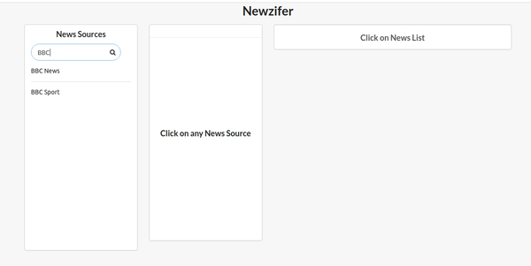
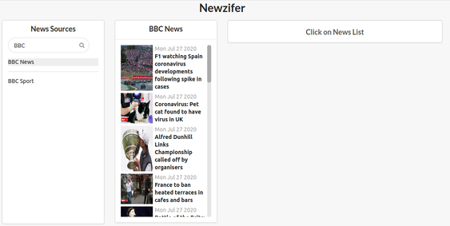
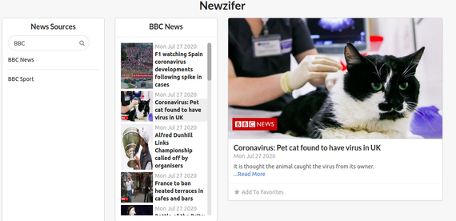

# Newzifer
A basic React-Redux Showing
- Interaction with network (used NewsAPI)
- Dynamic Search for news Sources
- Semantic UI React

#ScreenShots:





# How To Install

```
- Clone the Repo and extract it
- npm install
- npm start
```
